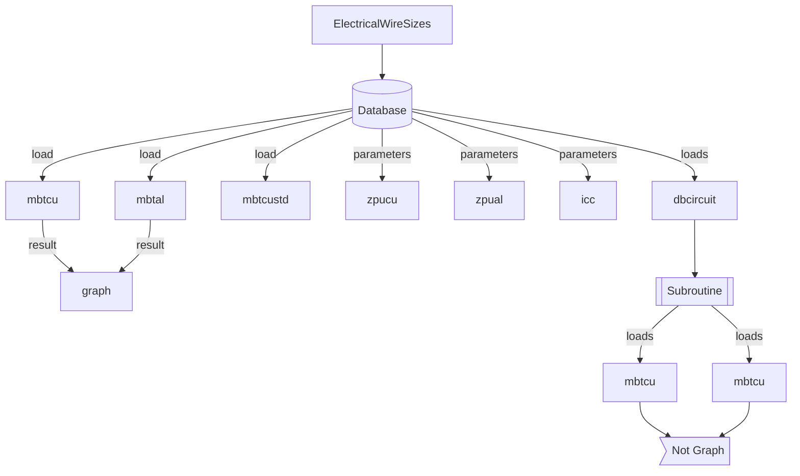

[](https://badge.fury.io/py/ElectricalWireSizes) [](https://pepy.tech/project/electricalwiresizes) [](https://pepy.tech/project/electricalwiresizes) [](https://pypi.org/project/ElectricalWireSizes/) [](https://codeclimate.com/github/jacometoss/PyEWS/maintainability)[](https://www.codacy.com/gh/jacometoss/PyEWS/dashboard?utm_source=github.com&amp;utm_medium=referral&amp;utm_content=jacometoss/PyEWS&amp;utm_campaign=Badge_Grade)

# Electrical Wire Sizes 

[Electrical Wires Sizes](https://pyews.readthedocs.io/) es una librería hecha en el lenguaje de programación Python y fue creada con la finalidad de acortar el tiempo en el dimensionamiento de conductores eléctricos u obtención de las secciones de los conductores de una instalación eléctrica.

Esta idea nace debido a la popularidad del lenguaje de programación Python y buscar una aplicación de este lenguaje dentro del área de ingeniería eléctrica en la especialidad de diseño de instalaciones eléctricas. En la práctica esta librería le será útil cuando trate de dimensionar una cantidad considerable de alimentadores como circuitos derivados.

La librería cuenta por el momento con **9 módulos** que internamente son llamados para realizar el dimensionamiento de conductores en baja tensión para conductores comerciales de 600 V hasta 2000 V, los resultados obtenidos se muestran en forma matricial o tabla para una mejor comprensión de los resultados.

La dependencia de este lenguaje de otros paquetes es baja únicamente usa `tabulate` en primer grado y en forma muy secundaría `numpy` y `matplotlib` no encontrándose limitado por el momento a una versión. Estas últimas dos librerías se usan para graficar las pérdidas de tensión de los conductores de corriente alterna.

La versión disponible la puedes consultar mediante  :

```python
version()
```

## [Donativos](https://ko-fi.com/jacometoss) 

**¿Te gusta este proyecto?, puedes apoyarme mediante**

La vida es como una batería y en cada momento uno va perdiendo una pequeña parte de esta cada día, puedes apoyarme en el desarrollo de este proyecto y motivar aún más mi creatividad para que sea de gran utilidad esta herramienta. Puedes contactarme si desconoces del medio proporcionado pero se basa en el sistema de pagos de PayPal.

[El apoyo es mediante un café :](https://ko-fi.com/jacometoss)

           ─▄▀─▄▀
           ──▀──▀
           █▀▀▀▀▀█▄
           █░░░░░█─█
           ▀▄▄▄▄▄▀▀
       Url para donativos      
    https://ko-fi.com/jacometoss                     

Este donativo es mínimo pero ayuda a mi creatividad, realmente la mínima cantidad es de $2 dólares.

## Instalación

La instalación del paquete se realiza mediante la instrucción siguiente :

```Python
pip install ElectricalWireSizes
```

## Módulos

Los módulos disponibles por el momento para esta versión son los siguientes :

| Id   | Descripción                                                  | Módulo        |
| ---- | ------------------------------------------------------------ | ------------- |
| 1    | Módulo de baja tensión para conductores de cobre clase B, C y D  tensión de 600V a 2000V. | mbtcu()       |
| 2    | Módulo de baja tensión para conductores de aluminio clase B, C y  D, tensión 600V a 2000V. | mbtal()       |
| 3    | Módulo de baja tensión para conductores de cobre clase B, C  y D en CD hasta 2000 V. | mbtcustd()    |
| 4    | Módulo para el cálculo de la impedancia para conductores de cobre. | zpucu()       |
| 5    | Módulo para el cálculo de la impedancia para conductores de aluminio. | zpual()       |
| 6    | Módulo para dimensionar múltiples conductores de cobre y aluminio., corriente alterna. | dbcircuit()   |
| 7    | Módulo para dimensionar múltiples conductores de cobre, corriente directa. | dbcircuitcd() |
| 8    | Módulo para graficar resultados                              | graph()       |
| 9    | Módulo de Icc para conductores de cobre y aluminio           | icc()         |

## Base de datos de conductores

Para poder ampliar el módulo se agregó la tabla de conductores donde incluye las resistencias y reactancias como ampacidades. Ingrese el código mostrado para visualizar la tabla completa.

```python
dbc(1)
```

## Graficar resultados

Mediante  `matplotlib` y`numpy`  es posible obtener gráficos, la instalación de esta librería es automática al instalar  `ElectricalWireSizes`.

Es posible graficar los resultados de pérdida de tensión de un único cálculo por el momento como se muestra en la figura siguiente :


Esta limitado para conductores en corriente alterna, el procedimiento para generar la figura es mediante :

```python
mydata=mbtal(127,220,55,1,45,1,1,35,3,1,0.9,2,1,1)
graph(mydata,"6 AWG","4/0 AWG", 8, 5, 2,"k",1)
```

El llenado del módulo es un poco complejo

- Realice un cálculo para conductores de cobre, en el ejemplo se guardo en  `mydata` .
- Llamamos al módulo llenamos como se indica 

```python
graph(mydata,"Calibre Inicial","Calibre Final", Ancho, Alto, Aluminio/Cobre, "Color",Sistema)
```

Los calibres deben ir como se muestra en los resultados y entre comillas dobles indicando un conductor inicial y final disponible, el ancho y alto son pulgadas en formato `integer` o `float`. Dependiendo el material del conductor (`1:Cobre, 2:Aluminio`) y el color de las barras puede usar `k: negro`, `b: azul`, `g:verde`, `r:rojo` que son estándar en reportes, finalmente el sistema `1:1F-2H`,`2:2F-3H`,`3:3F-3H` y `4:3F:4H`.

No olvide que el arreglo de datos  `mydata` debe ser correcto y definido.

## Nivel de corto circuito en conductores 

En esta versión (0.1.22) se incluye el cálculo del corto circuito de los conductores de cobre y aluminio en corriente alterna. Únicamente por el momento sirve de consulta para  determinar si el conductor.

Una forma sencilla de ingresar a este módulo usando la línea siguiente :

```text
icc(conductor,t1,t2,fhz,view)
#conductor: Material conductor.
---- 1:(1F-2H) 2:(2F-3H) 3:(3F-3H) 4:(3F-4H)
#t1: Temperatura de operación en °C.
#t2: Temperatura de corto circuito en °C.
#fhz: Frecuencia 50hz o 60hz.
#view: Modo de visualizar
---- 1:(Tabla) 2:(Lista)
```

Un ejemplo práctico de las corriente de corto circuito para los conductores comerciales es :

```python
icc(1,75,200,60,1)
```


> En forma práctica los termoplásticos como lo son el **PVC** tienen temperatura en corto circuito de 105,130,150 para las temperaturas de operación continua de 60,75,90. Los termoestables **XLPE**  y **EPR** en corto circuito usan temperaturas de 250 cada uno para una temperatura de operación continua de 90 °C.

## Desarrollador y versión

La versión 0.1.27rc1 es un pre-release candidato a presentarse como proyecto. 

```text
[Packqge]: ElectricalWireSizes 0.1.27rc1
[Autor]: Marco Polo Jácome Toss
[Licencia]: GNU General Public License v3.0
[Fecha]: 13-Diciembre-2022
[Páis]: México
```

## Changelog 

**0.1.27rc1** - Presenta un nuevo campo para el ajuste de la protección conforme a la NOM-001-SEDE-2012 de instalaciones eléctricas. Los módulos que sufrieron cambios son: `mtbcu` ,`mbtal`, `dbcircuit`.



## Referencias

[1] Norma Oficial Mexicana NOM-001-SEDE-2012, *Instalaciones Eléctricas (utilización)*

[2] Thue, W., 1978. *Electrical Power Cable Engineering*. 2nd ed. New York, Basel: Marcel Dekker Inc., p.34.

[3] Norma Oficial Mexicana NOM-001-SEDE-2018, *Instalaciones Eléctricas (utilización)*

## Copyright

Copyright © 2020 en adelante, Marco Polo Jácome Toss (http://electricalwiresizes.org).

Este programa es software libre: usted puede redistribuirlo y /o modificarlo bajo los términos de la Licencia General GNU (GNU General Public License) publicado por la Fundación para el Software Libre para la versión 3 de dicha Licencia o anterior, o cualquier versión posterior.

Este programa se distribuye con la esperanza de que sea útil pero sin ninguna garantía; incluso sin la garantía implícita de comercialización o idoneidad para  un propósito en particular.

Vea la información de Licencia de `ElectricalWireSizes` para más detalle.

