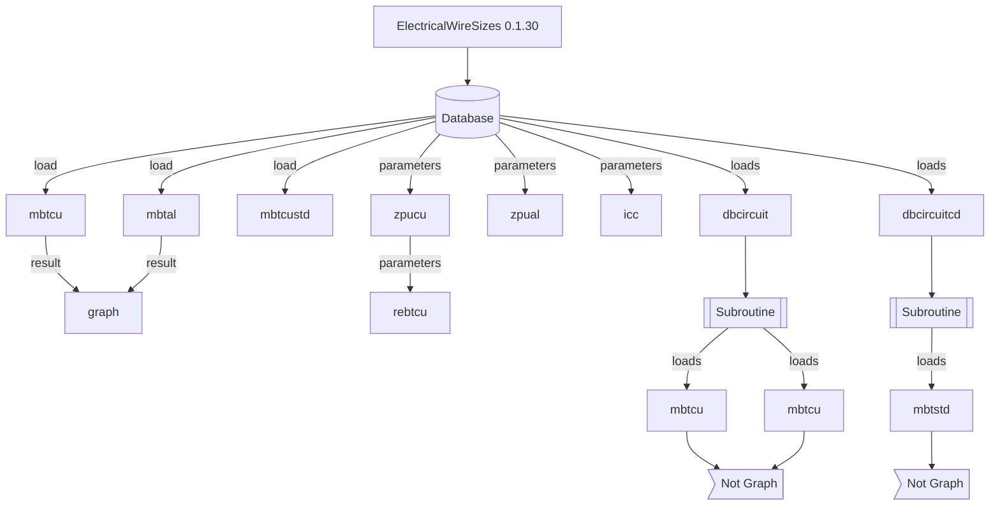

[](https://badge.fury.io/py/ElectricalWireSizes) [](https://pepy.tech/project/electricalwiresizes) [](https://pepy.tech/project/electricalwiresizes) [](https://pypi.org/project/ElectricalWireSizes/) [ ](https://codeclimate.com/github/jacometoss/PyEWS/maintainability) [](https://www.codacy.com/gh/jacometoss/PyEWS/dashboard?utm_source=github.com&amp;utm_medium=referral&amp;utm_content=jacometoss/PyEWS&amp;utm_campaign=Badge_Grade)

# **Electrical Wire Sizes** 

[Electrical Wires Sizes](https://electricalwiresizes.org/) es un paquete hecho en el lenguaje de programación Python, creado con la finalidad de acortar el tiempo en el dimensionamiento de conductores eléctricos u obtención de secciones de conductores para una instalación eléctrica. Esta idea nace debido a la popularidad del lenguaje de programación Python y en la búsqueda de una aplicación de este lenguaje dentro del área de ingeniería eléctrica, específicamente para baja tensión. 

En la práctica este paquete le será útil cuando trate de dimensionar una cantidad considerable de alimentadores y circuitos derivados, la versión actual cuenta por el momento con **10 módulos**, necesarios para dimensionar conductores en corriente alterna y directa usando los métodos de pérdida de tensión y capacidad de corriente, por otra parte, los resultados pueden ser visualizados mediante una lista o tabla estructurada, esta última depende de una librería conocida como `tabulate`.

La relación de las dependencias de este paquete con otros es baja,  `tabulate` es una dependencia de primer grado, por otra parte,  `numpy` y `matplotlib` se encuentran en segundo grado, estos últimos son un paquetes y una librería, por tanto,  ambos no se limitan a una versión en especifico para el uso del paquete ElectricalWireSizes. 

La consulta de la versión de este paquete se realiza mediante la instrucción siguiente:

```python
version()
```

> Este programa se basa en el Sistema Métrico Decimal y NOM-001-SEDE-2012 de Instalaciones Eléctricas publicada en el DOF de México, en futuras versiones se incluirá el Sistema Imperial y NEC-2020 exclusivo para Estados Unidos. 
>
> "Puedes apoyar el desarrollo de este proyecto mediante un donativo", [clic aquí](https://ko-fi.com/jacometoss).

## **[Donativos](https://ko-fi.com/jacometoss)** 

¿Te gusta este proyecto?, puedes apoyarlo mediante un donativo

La vida es como una batería y en cada momento uno va perdiendo una pequeña parte de esta cada día, puedes apoyar el desarrollo de este proyecto para que sea de mejor utilidad. Si desconoces del medio proporcionado puedes contactarme, se basa en el sistema de pagos de PayPal.

[El apoyo es en forma representativa al precio de un café ...](https://ko-fi.com/jacometoss)

           ─▄▀─▄▀
           ──▀──▀
           █▀▀▀▀▀█▄
           █░░░░░█─█
           ▀▄▄▄▄▄▀▀
       Url para donativos      
    https://ko-fi.com/jacometoss                     

El [donativo](https://ko-fi.com/jacometoss) apoya a este proyecto, la aportación mínima es de $2 dólares, algo insignificante para algo de este nivel.

## Curso instruccional ElectricalWireSizes

Si eres de las personas que no les gusta esperar y desea impulsar el desarrollo del software libre puedes adquirir el curso instruccional, en este se explica la forma correcta de usar el paquete ElectricalWireSizes, para adquirirlo da [clic auí](https://electricalwiresizes.org/courses/ews0130).

El curso esta estructurado en tres unidades y 20 lecciones, puedes consultar el contenido dando [clic aquí](https://electricalwiresizes.org/courses/ews0130).

## **Instalación**

La instalación de la última versión de este paquete se obtiene mediante la instrucción siguiente:

```Python
pip install ElectricalWireSizes
```

## **Módulos**

Un resumen de los módulos disponibles para este paquete se muestra en la tabla siguiente:

| **Id** | **Descripción**                                              | **Módulo**                                                   |
| ------ | ------------------------------------------------------------ | ------------------------------------------------------------ |
| 1      | Módulo de baja tensión (c.a.) para el dimensionamiento de conductores de cobre (clase B, C y D)  tensión máxima de operación de 600V y 2000V. | [mbtcu()](https://electricalwiresizes.org/mbtcu.html)        |
| 2      | Módulo de baja tensión (c.a.) para el dimensionamiento de conductores de aluminio (clase B, C y  D) tensión máxima de operación de 600V y 2000V. | [mbtal()](https://electricalwiresizes.org/mbtal.html)        |
| 3      | Módulo de baja tensión (c.d.) para el dimensionamiento de conductores de cobre (clase B, C  y D) tensión máxima de operación de 600V y 200V. | [mbtcustd()](https://electricalwiresizes.org/mbtcustd.tml)   |
| 4      | Módulo de impedancia en conductores de cobre comerciales.    | [zpucu()](https://electricalwiresizes.org/zpucu.html)        |
| 5      | Módulo de impedancia en conductores de aluminio comerciales. | [zpual()](https://electricalwiresizes.org/zpual.html)        |
| 6      | Módulo para el dimensionamiento de múltiples conductores de material cobre y aluminio en corriente alterna. | [dbcircuit()](https://electricalwiresizes.org/dbcircuit.html) |
| 7      | Módulo para dimensionar múltiples conductores de material cobre en corriente directa. | [dbcircuitcd()](https://electricalwiresizes.org/dbcircuitcd.html) |
| 8      | Módulo de gráficas de barras para conductores en corriente alterna. | [graph()](https://electricalwiresizes.org/graph.html)        |
| 9      | Módulo de corto circuito (Icc) para conductores de cobre y aluminio. | [icc()](https://electricalwiresizes.org/icc.html)            |
| 10     | Módulo de pérdidas de tensión (c.a.) en conductores de material cobre  por cargas distribuidas. | [rebtcu()](https://electricalwiresizes.org/rebtcu.html)      |

## **Base de datos de conductores**

El paquete contiene un registro de conductores comerciales y en este se incluye las reactancias, ampacidades y secciones, se debe agregar que para ingresar al contenido debe importar correctamente el paquete con el módulo deseado e ingresar la instrucción siguiente:

```python
dbc(1)
```

## **Graficar resultados**

Mediante el uso de  `matplotlib` y `numpy`  es posible obtener un gráfico de las pérdidas de tensión alterna para los conductores comerciales de cobre o aluminio. El gráfico que se muestra al final del párrafo contiene las pérdidas de tensión de los conductores de material aluminio cuando se implementa un sistema monofásico de una fase dos hilos.


El procedimiento para generar el gráfico anterior es usando las instrucciones siguientes:

```python
mydata=mbtal(127,220,55,1,45,1,1,35,3,1,0.9,2,1,60,1.25,1.25)
graph(mydata,"6 AWG","4/0 AWG", 8, 5, 2,"k",1,3)
```

El llenado del módulo es un poco complejo y se requiere lo siguiente:

- Primero, realizar un cálculo con el módulo  `mbtcu`  o  `mbtal` y el resultado obtenido se guarda en una nueva variable; por ejemplo,  `mydata` .
- Segundo, se transfiere los resultados al módulo `graph` como se muestra en el bloque siguiente: 

```python
graph(mydata,"Calibre Inicial","Calibre Final", Ancho, Alto, Aluminio/Cobre, "Color",Sistema)
```

Es posible limitar los conductores en el gráfico, por otra parte, las secciones de los conductores se deben escribir entre comillas dobles indicando un conductor inicial y un conductor final que se encuentre disponible en la base de datos, habría que decir también que el ancho y alto del gráfico debe estar en pulgadas y en formato `integer` o `float`. 

El gráfico puede únicamente contener un material conductor (`1:Cobre, 2:Aluminio`) y el color de las barras habitualmente son (`k: negro`, `b: azul`, `g:verde`, `r:rojo`), estos colores son estándar en reportes, no obstante, puede usar otros disponibles dentro de la paleta de colores de `matplotlib`. 

Finalmente, la selección del sistema (`1:1F-2H`,`2:2F-3H`,`3:3F-3H` y `4:3F:4H`) es indispensable indicarlo y conviene subrayar que el arreglo de datos (`mydata`) debe ser en formato lista y no tabla para que funcione correctamente el módulo `graph`.

## **Corto circuito en conductores** 

Desde la versión 0.1.22 se incluye el cálculo de corto circuito para los conductores de cobre y aluminio para tensión de corriente alterna, este módulo dimensiona un conductor en estado de corto circuito y se incluye desfasado de los módulos restantes para evitar un dimensionamiento excesivo y más cuando no existe un estudio de corto circuito formal.

Algunas instrucciones de este módulo son:

```python
icc(conductor,t1,t2,fhz,view)
'''
    #conductor: Material conductor.
    ---- 1:(1F-2H) 2:(2F-3H) 3:(3F-3H) 4:(3F-4H)
    #t1: Temperatura de operación en °C.
    #t2: Temperatura de corto circuito en °C.
    #fhz: Frecuencia 50hz o 60hz.
    #view: Modo de visualizar
    ---- 1:(Tabla) 2:(Lista) 
 '''
```

Un ejemplo práctico para obtener las corriente de corto circuito de los conductores comerciales de material cobre se muestra en el bloque siguiente:

```python
icc(1,75,200,60,1)
```


> Los materiales termoplásticos son usados para el aislamiento de conductores de material cobre o aluminio, entre estos se encuentra el **PVC**, este tiene una temperatura de operación en corto circuito de 105, 130 y 150 grados centígrados. En condiciones  normales o de operación continua las temperaturas del aislamiento termoplástico son básicamente de 60, 75 y 90 grados centígrados, por tanto, en condiciones normales se deben relacionar con las temperaturas correspondientes. 
>
> Los materiales termoestables son aislamientos de **XLPE** y **EPR** para conductores de material cobre o aluminio,  la temperatura  de corto circuito de estos aislamientos es de 250 grados centígrados y se relaciona con la temperatura operación continua de 90 °C del conductor.

## **Desarrollador**

La versión `0.1.30` es por el momento la más reciente. 

```text
[Packqge]: ElectricalWireSizes 0.1.30
[Autor]: Marco Polo Jácome Toss
[Licencia]: GNU General Public License v3.0
[Fecha]: 22-Febrero-2023
[Páis]: México
```

## **Control de versiones (Changelog)**

**0.1.30**:  Versión estable. Incluye un nuevo módulo para calcular pérdidas de tensión en distintos puntos de caga y se agrega la opción de capacidad de corriente en los conductores para los módulos `mbtcu()` y  `mbtal()`. Además, se actualizan las protecciones del módulo `mbtcustd()`. [*19.02.2023*]

**0.1.30rc1**:  Se modifica y clasifica las protecciones por sistema descartando las no comerciales. [*10.07.2022*]

**0.1.29**: Versión estable. En esta nueva actualización se agrega al módulo `graph` una línea indicadora de pérdida de tensión.[*07.07.2022*]

**0.1.29rc1**: Se modifican los módulos `mbtcu`, `mbtal`, `mbtcustd`, `dbcircuit`, `dbcircuitcd` adicionando un nuevo argumento `Fcond` y condiciones para el cumplimento del 125% de ampacidad en alimentadores y circuitos derivados sin considerar cualquier factor de ajuste. Todas las versiones anteriores no cuentan con esta condición y esto puede causar error cuando se tienen las condiciones ideales en un conductor, sin agrupar y a temperatura ambiente de 30°C. [*03.07.2022*]

**0.1.28**: Versión estable. [*15.06.2022*]

**0.1.28rc2**: Separación de operaciones entre conductor y protección.[*02.06.2022*]

**0.1.28rc1** - En esta versión se actualiza las protecciones y la fórmula de corriente incluyendo el factor de sobrecorriente. En la versión 0.1.27 no se logra ver la actualización de la corriente nominal en la lista o tabla. [*01.06.2022*]

**0.1.27** - Versión estable. [*20.04.2022*]

**0.1.27rc3** - En esta versión los módulos se han clasificado e independizado en distintos archivos, además se mejora la salida de datos del módulo `dbcircuit` para funciones futuras. [*20.04.2022*]

**0.1.27rc2** - Corrección de  fechas de actualización en módulos. Los módulos `mbtcustd`, `dbcircuitcd` fueron modificados conforme a los requerimientos de protección y capacidad de corriente de los conductores.  [*19.03.2022*]

**0.1.27rc1** - Presenta un nuevo campo para el ajuste de la protección conforme a la NOM-001-SEDE-2012 de instalaciones eléctricas. Los módulos que sufrieron cambios son: `mtbcu` ,`mbtal`, `dbcircuit` conforme a los requerimientos de protección y capacidad de conductores.  [*13.03.2022*]

## Estructura del paquete




## **Referencias**

[1] Norma Oficial Mexicana NOM-001-SEDE-2012, Instalaciones Eléctricas (utilización)

[2] Thue, W., 1978. Electrical Power Cable Engineering. 2nd ed. New York, Basel: Marcel Dekker Inc., p.34.

[3] Norma Oficial Mexicana NOM-001-SEDE-2018, Instalaciones Eléctricas (utilización)

## **Copyright**

Copyright © 2023 en adelante, Marco Polo Jácome Toss (http://electricalwiresizes.org).

Este programa es software libre: usted puede redistribuirlo y /o modificarlo bajo los términos de la Licencia General GNU (GNU **General Public License**) publicado por la Fundación para el Software Libre para la versión 3 de dicha Licencia o anterior, o cualquier versión posterior.

Este programa se distribuye con la esperanza de que sea útil pero sin ninguna garantía; incluso sin la garantía implícita de comercialización o idoneidad para  un propósito en particular.

Vea la información de Licencia de `ElectricalWireSizes` para más detalle.

------

Copyright ©2023  en adelante, [ElectricalWireSizes](https://electricalwiresizes.org/)
